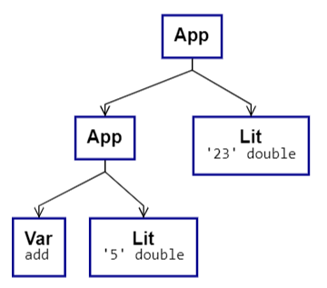

* Querysprache, die ...
    * (Objekt)Hierarchien müssen abbildbar sein
* Beispiel-Queries (rein sprachlich)
  * Es muss möglich sein, Queries zu schachteln
* Anforderungen, aus denen sich die Sprache ableitet
  * Daraus folgt:
    * Elemente einer Querysprache müssen rekursiv sein
    * Instanzen der Sprache haben demnach die Form eines Baumes und werden im Folgenden "AST" (Abstract Syntax Tree) genannt.
  * der AST ist serialisierbar und bietet gleichzeitig die API aus Sicht eines Clients
  * Möglichkeit, Literale anzugeben:
    * Enums, Strings, Bool, Number (int + double), Listen
    * Aufruf von Funktionen (z.B. "ToLower" auf Strings) - Funktionen können Built-In sein
    * Zugriff auf Properties von Objekten
    * Definition von Lambda-Funktionen (z.B. um Predikate abzubilden)
  * Die Sprache soll frei von Typannotationen sein (Beispiele bringen)
  * TODO:
    * Tuple (wichtig für APP)
    * appn
* Typisierung:
  * Wird hier ansatzweise beschrieben
  * Kann aber später ggf. von Typisierungs-Backends vorgenommen werden (z.B. C#- oder F#-Compiler)
* Ausführung
  * Wird hier nur am Rande behandelt. Prinzipiell gilt:
  * Ähnlich Typisierung: Aus dem AST wird CLR-Code generiert, der ausgeführt werden kann
* Annotationen und Statements
  * Werden hier nur am Rande behandelt. Prinzipiell gilt:
  * Die Sprache ist an für sich frei von Statements
  * Eine Ausnahme sind Annotationen (z.B. für Caching / Views)
* Erweiterungen ("Syntax Sugar")
  * Die Sprache ist im Kern touringkomplett.
* Scope dieses Dokuments:
  * "Sprache" entwickeln.
    * Sprache wird abgebildet über syntaktische Elemente
    * Darauf aufbauend _könnte_ eine textuelle Sprache aufgesetzt werden, die 
* Pseudo-Code beschreiben
* Sprachelemente kurz beschreiben mit Pseudocode
* Query-Beispiele:
  * Pseudocode und AST
* Aufbau konkreter Syntaxen
  * Kern ist allgemein. Im Folgenden werden 2 Syntaxen vorgestellt, die bekannte Operationen auf Sequencen (.Net IEnumerable<_>) in Form neuer Syntaxelemente zur Verfügung stellen. Diese Elemente werden dann vom Backend auf die Kernformen umgesetzt
    * -> Für jedes Element ein Beispiel bringen
    * Varianten
      * a: Sequence-Op Sytnax
        * Pipe: Ist "Sugar", um Pipelines aufzubauen
      * b: Query-COmprehension Syntax
        * For-Expression
* Options / Defaults
* Views / Predefined backend queries
* Shadowing
* TODO: Unit Funktionen haben steht einen Rückgabetyp. 
* Let ist auch nur syntactic sugar
* Typinferenz in C# ist stark begrenzt
  * Problem: Identity funktion; die kann nicht inline geschrieben werden (so wie vieles andere auch). Hier benötigen wir evtl. einen eigenen Typinferenzmechanismus

```
  // Problem: Identity funktion; die kann nicht inline geschrieben werden
  //let idExp = Abs "x" (Var "x")
  //id
  //^| Let "f" idExp
  //^| Let "res1" (App (Var "f") (Number 99.0))
  //^| Let "res2" (App (Var "f") (String "HelloWorld"))
  //^| Var "res2"
  ////|> showUntypedAst
  //|> tocscode |> printfn "%s"

  //App (Var "add") (String "HelloWorld")
  //|> showUntypedAst
```


\
\
\
\
\
\
\
\
\

# Anforderungen

* Performance
  * Caching, Kompilierung
* Einfach
  * Typinferenz
* Mächtig
  * Berechenbarkeit
* Offen für Erweiterungen
* Querysprache muss rekursiv sein (s.u.)
* platformunabhängig (in der Verwendung)

\
\
\
\
\
\
\
\
\

# Beispiele

> Die Namen und IDs der ersten 10 Blockkanten,
> über die mehr als 'x' Sendungen laufen.

oder

> Das Kreuzprodukt aller Blockkanten mit deren Sendungen

oder

> Gruppiere alle Blockkanten nach Blockkantentyp
> Von der 3. Gruppe alls Blockkanten

oder

> Gruppiere alle Blockkanten nach Blockkantentyp
> und aggregiere:
> - Sum (Anz. der Sendungen)
> - Median (Länge der BKs)
> - Avg (Laufzeit der Sendungen für Sendungen, die über mehr als 3 BKs laufen)


Codde-Beispiel:

```
context.BlockEdges
  .map(be =>
    let sumOfShipments = be.Shipments
      .map(s => s.Length)
      .sum()
    let whatever = sumOfShipments + 12.0
    new { Id = be.Id; Length = whatever})
```

```
context.BlockEdges
  .map<BlockEdge, ???>(be =>
    double sumOfShipments = be.Shipments
      .map<Shipment, Shipment>(s => s.Length)
      .sum<Shipment, double>()
    double whatever = sumOfShipments + 12.0
    new { Id = be.Id; Length = whatever})
```

\
\
\
\
\
\
\
\
\
\
\


Frage:

> Welche Sprachelemente werden hier verwendet?

\
\
\
\
\
\
\
\
\
\
\
\

## Basis-Syntax

Der Abfragesprache lieg ein im Kern stark vereinfachter Kalkül zugrunde. Sie setzt sich aus Ausdrücken $e$ zusammen und ist durch die folgende Syntax gegeben:

$$
\begin{array}{r@{\ }c@{\ }l@{\ }l@{\ }}
e & :=    & c                                                   && \text{Lit}  \\
  & \mid  & x                                                   && \text{Var}  \\
  & \mid  & e_1 \ e_2                                           && \text{App}  \\
  & \mid  & \lambda x . e                                       && \text{Abs}  \\
  & \mid  & \boldsymbol{let} \ x = e_1 \ \boldsymbol{in} \ e_2  && \text{Let}  \\
\\
c & :=   & bool     \\
  & \mid & number   \\
  & \mid & string   \\
\end{array}
$$


\
\
\
\
\
\
\
\
\
\
\
\

**Erläuterungen**

*Lit* sind Konstanten, die sich aus einer Reihe von Basistypen zusammensetzen.

*Var* referenziert einen im Kontext an $x$ gebunden Ausdruck, welche z.B. durch die Bindung in $abs$ oder $let$ entstehen oder durch einen externen Kontext (siehe TODO).

*App* ist Funktionsapplikation und wendet $e_2$ auf $e_1$ an.

*Abs* definiert eine *anonyme Funktion*. Die Variable $x$ ist im Kontext von $e$ gebunden. Funktionen haben stets ein einziges Argument. Funktionen mit mehr als einem Argument können durch Currying (siehe unten) oder Tuple abgebildet werden.

*Let* bindet den Ausdruck $e_1$ an die Variable $x$, welche in $e_2$ verfügbar ist.


\
\
\
\
\
\
\
\
\
\
\
\

**Erweiterungen**

Die Syntax wird später durch weitere Elemente erweitert. Erweiterungen können z.B.

* als *syntactic sugar* in Form von neuen Termen definiert werden oder
* durch Verwendung vorhandener Elemente in Form zur Verfügung stehender, bekannter Funktionen.

Notwendige Erweiterungen ergeben sich z.B. aus der Notwendigkeit für

* die Definition von *Listen* (z.B. `[ 1; 2; 3 ]`)
* die Definition von *Tupeln* (z.B. `(1, "a", true)`)
* den Zugriff auf *Objektproperties* (z.B. `instance.prop1.prop2`)
* die Verwendung von *Casts* und die damit verbundene Notwendigkeit zur *Angabe von Typen*
* die Verwendung von *Emun*-Werten
* die Angabe von *Metadaten*; z.B.
  * zum Verweis auf *Remote-Properties* in entfernten Planungsinstanzen
  * zur Angabe von *Caching*-Wünschen
* den Umgang mit *Optionalität* und *null*
* die Erzeugung neuer *Objektinstanzen*
* die (inline)-Definition von *Records*
* *Rekursionen*
* if-Expressions (TODO: was kann hier durch Library-Funktionen abgedeckt werden?)


\
\
\
\
\
\
\
\
\
\
\
\


## Typisierung

Das o.g. Kalkül weist einem Ausdruck keinen Typ zu und es kennt auch keine Typen. Eine Typisierung wird jedoch darauf aufbauend vorgenommen werden. Um ein besseres Verständnis vom Zusammenhang zwischen Sprachsyntax und Typen zu bekommen, wird ein Basistypsystem erläutert:

Das Typsystem ist definiert durch:

$$
\begin{array}{r@{\ }c@{\ }l@{\ }l@{\ }r{\ }}
\text{Monotype}                                                         \\
\tau   & :=   & B                               & \text{Base}           \\
       & \mid & \tau_1 \rightarrow \tau_2       & \text{Function}       \\
       & \mid & \alpha                          & \text{Variable}       \\
       & \mid & \tau_1 \ \tau_2                 & \text{Application}    \\
\text{Polytype}                                                         \\
\sigma & :=   & \forall(\alpha_1, \ \dots \ \alpha_n) . \tau  & \text{Quantification}
\end{array}
$$

Das System ist *prenex-polymorph*. Typvariablen $\alpha$ können also nicht mit polmorphen Typen ($\sigma$) instanziiert werden, sondern nur mit monomorphen ($\tau$) (wie auch in .Net).


\
\
\
\
\
\
\
\
\
\
\
\

**Beispiele**

*Basistypen* werden als Literal geschrieben, z.B.: $Int$ oder $String$.

*Funktionstypen* werden in Curryform geschrieben. Eine Funktion, die $Number$ in $String$ umwandelt, sieht so aus:

$$
Number \rightarrow String
$$

Eine Funktion wie z.B. *add*, die 2 Zahlen entgegennimmt und eine Zahl zurückliefert, hat diesen Typ:

$$
Number \rightarrow Number \rightarrow Number
$$

Für *Polymorphe Typen* ("Generics" in .Net) werden die Typvariablen durch einen Quantifikator gebunden, so dass sie im Kontext von $\tau$ verfügbar sind. Dort können sie auf *Monotypen* angewendet werden. Das folgende Beispiel zeigt den Typ einer nicht näher spezifizierten Liste mit einem polymorphen Elementtyp, sowie eine Map (Dictionary) mit 2 Typvariablen $k$ und $v$:

$$
\begin{align*}
\forall a \    &. \ List \ a                       \\
\forall (k, v) \ &. \ Dictionary \ k \ v           \\
\\
\text{Weitere Beispiele:}                          \\
\\
\forall a   \ &. \ Task \ (List \ a)               \\
\forall v   \ &. \ Task \ (Dictionary \ Int \ v)   \\
\forall a   \ &. \ List \ (a \rightarrow String)   
\end{align*}
$$


\
\
\
\
\
\
\
\
\
\
\
\

**Schreibweise im Pseudocode**

Als Alternative zur obigen Syntax wird in den Beispielen für Polytypen eine Schreibweise verwendet:

* Typvariablen werden mit vorangestelltem $'$ geschrieben 
* Quantifikation ist implizit
* Applikation in Tupleform und in eckigen Klammern

Für die obigen Beispiele ergibt sich:

```
List<'a>                    // Eine Liste von 'a s
Dictionary<'k, 'v>          // Ein Dictionary mit 'k als Key und 'v als Value
Task<List<'a>>              // Ein Task mit Liste von 'a s
Task<Dictionary<Int, 'v>>   // Ein Task mit einem Dictionary mit Int als Key und 'v als Value
List<'a -> String>          // Eine Liste von Funktionen, die aus 'a einen String machen
```


\
\
\
\
\
\
\
\
\
\
\
\

# Abfragesprache


\
\
\
\
\
\
\
\
\
\
\
\


## Abbildung der Syntax als AST

**Beispiel 1**

Es werden 2 Zahlen addiert. Es wird vorausgesetzt, dass `add` im Kontext verfügbar ist. Es ist vom Typ `number -> number -> number`:

```
add 5.0 23.0
```

Mit *add* wird auf einen Bezeichnet im Kontext zugegriffen. Add ist eine Funktion, auf die das *number*-Literal 5.0 angewendet wird. Das Resultat ist ein Funktionsausdruck, auf den das *number*-Literal 23.0 angewendet wird. Funktionsaufrufe werden nicht wie üblich in Tupleform (`add(5.0, 23.0)`) angegeben.

Der gezeigte Code lässt sich wie folgt abbilden:



**Beispiel 2**

Es werden 2 Zahlen addiert. Es wird vorausgesetzt, dass `add` im Kontext verfügbar ist. Es ist vom Typ `number -> number -> number`:

```
add 5.0 23.0
```

Mit *add* wird auf einen Bezeichnet im Kontext zugegriffen. Add ist eine Funktion, auf die das *number*-Literal 5.0 angewendet wird. Das Resultat ist ein Funktionsausdruck, auf den das *number*-Literal 23.0 angewendet wird. Funktionsaufrufe werden nicht wie üblich in Tupleform (`add(5.0, 23.0)`) angegeben.

Der gezeigte Code lässt sich wie folgt abbilden:


